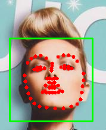

# facedata
结合Openface与关键点对数据集重新处理

可以根据人脸68个关键点位置重塑人脸为128*128(可根据需要修改)

# Example
<center class="half">
    
    
    
</center>


## Usage

```python
cd openface
pip install -r requirements.txt

python process.py
#修改input和output
```

